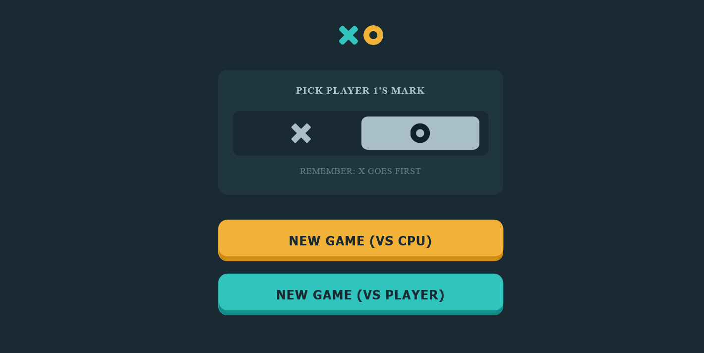

# Frontend Mentor - Tic Tac Toe solution

This is a solution to the [Tic Tac Toe challenge on Frontend Mentor](https://www.frontendmentor.io/challenges/tic-tac-toe-game-Re7ZF_E2v). Frontend Mentor challenges help you improve your coding skills by building realistic projects.

## Table of contents

- [Overview](#overview)
  - [The challenge](#the-challenge)
  - [Screenshot](#screenshot)
  - [Links](#links)
- [My process](#my-process)
  - [Built with](#built-with)
  - [What I learned](#what-i-learned)
  - [Continued development](#continued-development)
  - [Useful resources](#useful-resources)
- [Author](#author)
- [Acknowledgments](#acknowledgments)

## Overview

### The challenge

Users should be able to:

- View the optimal layout for the game depending on their device's screen size
- See hover states for all interactive elements on the page
- Play the game either solo vs the computer or multiplayer against another person
- **Bonus 1**: Save the game state in the browser so that it’s preserved if the player refreshes their browser
- **Bonus 2**: Instead of having the computer randomly make their moves, try making it clever so it’s proactive in blocking your moves and trying to win

### Screenshot

### Links

- Solution URL: [https://github.com/niche-web/tic-tac-toe.git]
- Live Site URL: [https://master--lucky-axolotl-f2078a.netlify.app/]

## My process

### Built with

- Semantic HTML5 markup
- CSS custom properties
- Flexbox
- CSS Grid
- Mobile-first workflow
- Vanilla JS

### What I learned

The biggest challenge has been being able to develop a logic for the development of the single-computer game, as well as organizing my code so that it is as understandable as possible and not get lost between all the lines as the code grew. To achieve this, I leaned on the objects, creating as much as possible and planning the steps to follow on paper. Try to manipulate the DOM using classes and not inline styling. I applied local storage by first time. As you get into more difficult projects you realize how important MDN and stack overflow are for web developers or developers in general.

### Continued development

For future projects I gonna focus on OOP making use of classes, also start using CSS transformation tools like postCSS and frameworks like React. Also introducing Webpack, I have been using Parcel.

### Useful resources

- [MDN](https://developer.mozilla.org/en-US/) - The best if you wanna go deep in web development .
- [stack overflow](https://stackoverflow.com/) - The best place to get help.

## Author

- Website - [Norge Rojas Cerulia](https://www.your-site.com)
- Frontend Mentor - [@niche-web](https://www.frontendmentor.io/profile/niche-web)
- Twitter - [@Nani45670378](https://www.twitter.com/Nani45670378)

## Acknowledgments

To MDN and stack overflow.
